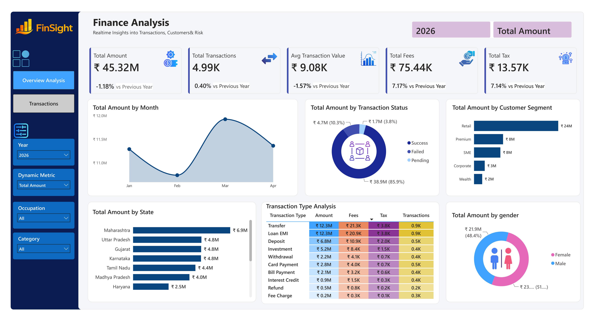
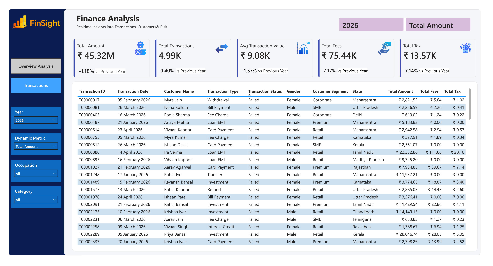
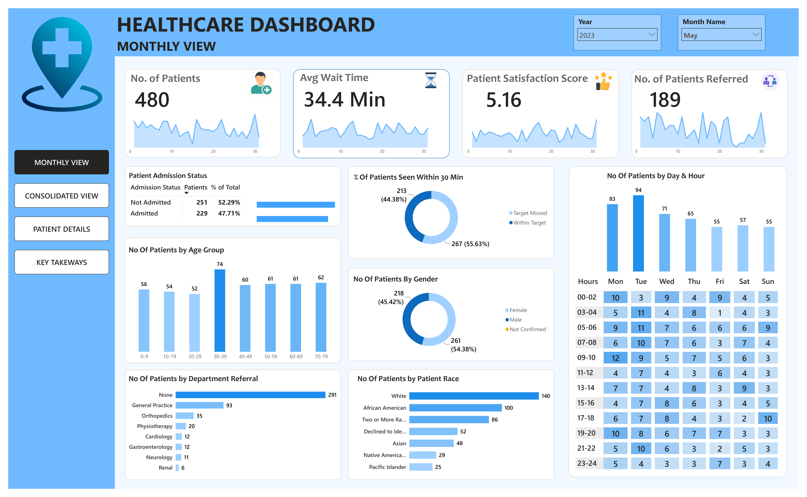
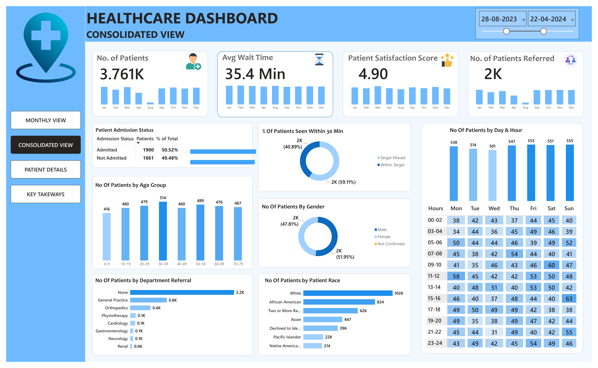
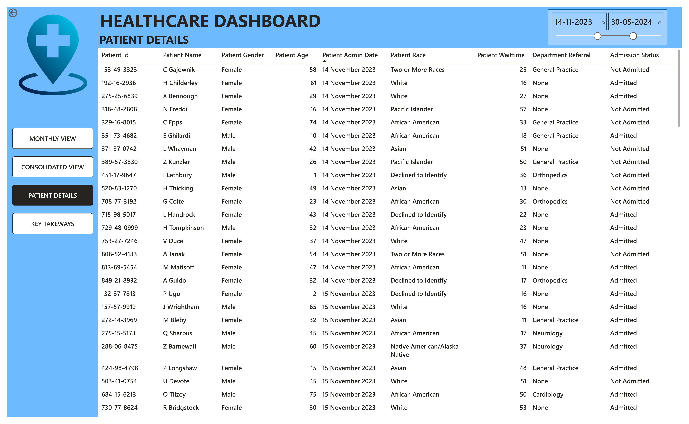
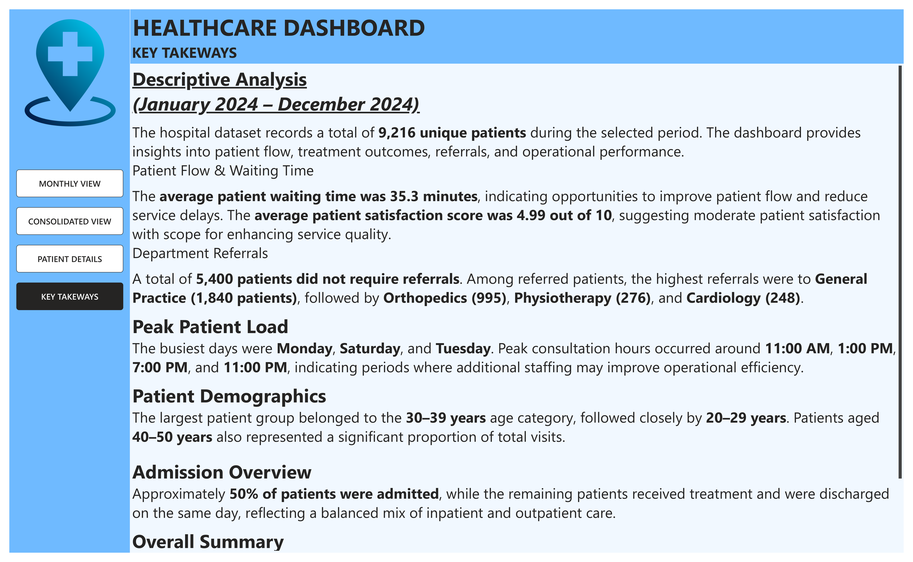

# 📊 Power BI Dashboard Portfolio

> **Interactive Power BI dashboards built using real-world datasets to transform raw data into actionable business insights through visualization, reporting, and analytics.**

---

# 💼 Business Finance Dashboard

### 📷 Dashboard Preview

### 📌 Project Overview

This dashboard provides an interactive view of business financial performance, helping stakeholders monitor revenue, profit, expenses, loan performance, and other key financial metrics.

### ✨ Key Features

- 💰 Revenue & Profit Analysis
- 📊 Executive KPI Cards
- 📅 Dynamic Date Filters
- 📈 Time Intelligence Analysis
- 🎯 Interactive Slicers
- 🔍 Drill Through Reports
- 📉 Financial Trend Analysis
- 📌 Business Performance Monitoring

---

# 🏥 Healthcare Dashboard

### 📷 Dashboard Preview

### 📌 Project Overview

An interactive healthcare analytics dashboard designed to monitor patient information, hospital performance, appointments, revenue, and operational KPIs.

### ✨ Key Features

- 📈 KPI Cards
- 👨‍⚕️ Patient Analytics
- 💊 Hospital Performance
- 📅 Interactive Slicers
- 🔍 Drill Through Reports
- 📊 Dynamic Charts
- 💰 Revenue Analysis
- 📌 Department-wise Insights

---

# 🛠 Tech Stack

- 📊 Power BI Desktop
- ⚡ Power Query
- 📐 DAX
- 📑 Microsoft Excel

---

# 🚀 Skills Demonstrated

- Data Cleaning
- Data Transformation
- Data Modeling
- Data Visualization
- Dashboard Design
- KPI Development
- DAX Measures
- Power Query
- Interactive Reporting
- Business Intelligence

---

# 👨‍💻 About Me

**Yash Patil**

🎓 Bachelor of Engineering – Computer Science & Business Systems

💼 Data Analyst | Power BI Developer

📍 Belagavi, Karnataka, India

📧 yash987patil654@gmail.com

🔗 GitHub: https://github.com/yashpatil9981

---

## ⭐ Support

If you found these dashboards useful, consider giving this repository a **Star ⭐**.
